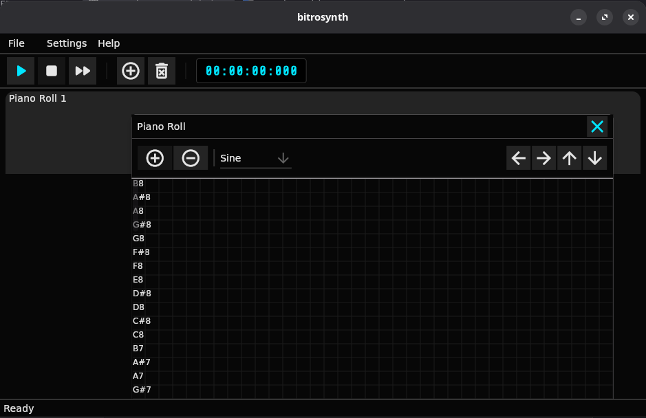

# BitroSynth

This project is a synthesizer with a graphical interface built using Flutter and a synthesis/playback engine implemented in Rust. It supports multiple waveforms including Sawtooth, Noise, Sine, Pink Noise, Square, and Triangle.

## 📜 Third-Party Licenses
All third-party libraries used in this project are documented in the `licenses` folder at the root of the source code.

Starting from version 3.0, this project is licensed under the Apache License, Version 2.0.

---

## © 2025 Hüseyin Berke - HBDigitalLabs
